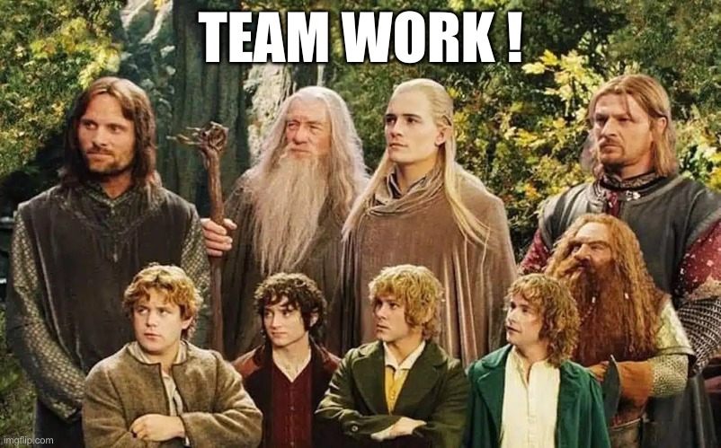
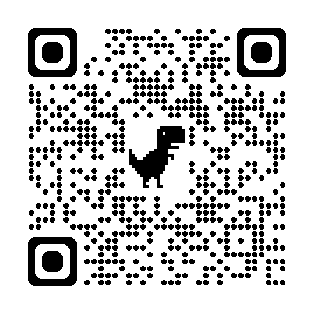
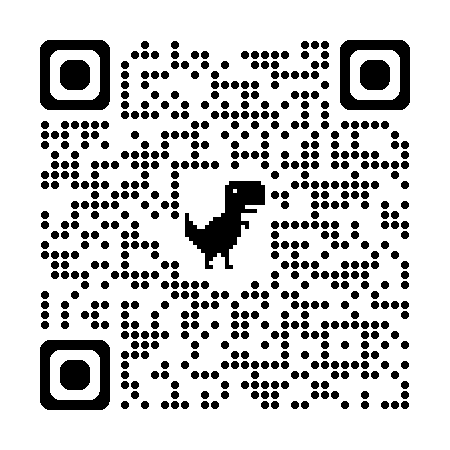

[.sauter-le-pas]
== Sauter le pas ?
// image::images/sauter-le-pas.jpeg[background, size=cover, class=test]

[NOTE.speaker]
--
* Pas si simple de répondre
* Une prise de risque actuellement
--

=== En résumé

[%step]
Pas adapté à tous les contextes

[%step]
Communauté réduite

[%step]
Tient ses promesses

[NOTE.speaker]
--
* Le projet est assez récent (open source)
** Failble maturité de l'écosystème
** Quelques soucis avec le linter
** Types perfectibles
* Force à penser différement
* Mais déjà très fonctionnel
* Ne pas avoir peur de se casser un peu les dents dessus, j'ai trouvé les réponses que je cherchais dans les issues ou dans le code source
--

=== L'heure du choix

[NOTE.speaker]
--
* Ne pas imposer des outils qui seraient inconfortables, pas valide dans tous les contextes (si vous disposez d'intégrateurs compétents ...)
* StyleX ne vous sauvera pas
** Pas si facile que ça à prendre en main
** Demande une bonne maitrise du CSS contrairement à Tailwind
** Ecosystème pauvre pour le moment, des bibliothèque de classes utilitaires pourraient venir compléter
** Il faut embrasser le model pour en tirer le maximum
--

[.questions]
=== Merci

[.qrcode.github]

--
[.qrcode.title.github]
Github
--

[.qrcode.openfeedback]

--
[.qrcode.title.openfeedback]
openfeedback
--

[NOTE.speaker]
--
* Remerciements, lien github, lien open feedback
--

