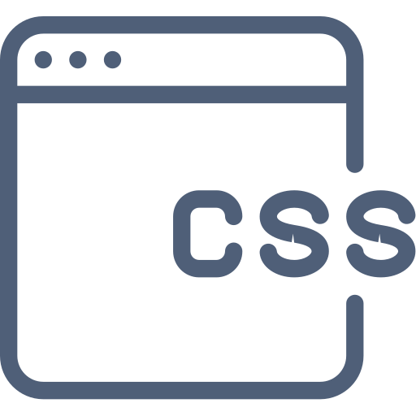

== Une histoire de style

[NOTE.speaker]
--
* StyleX c'est une histoire de Style
* Histoire de la problématique de poids des CSS (+10Mo de style sur Facebook.com à l'époque)
* Meta a communiqué la première fois en 2021
* Aujourd'hui au sein des principales application de Meta Theads, Facebook, Instagram
* https://www.youtube.com/watch?v=ur-sGzUWId4
--

=== Le CSS à travers les âges

[%step]
--
[.frise]
image::./images/frise-chrono-vide.drawio.svg[]

[.frise-date.frise-top.frise-date-css2]
1998
[.frise-item.frise-bottom.frise-item-css2]

--

[.fade-right%step]
--
[.frise-item.frise-item-sass]
image::./images/frise/sass.svg.png[]
[.frise-date.frise-date-sass]
2006
--

[.fade-right%step]
--
[.frise-item.frise-item-css3]
image::./images/frise/css3.svg[]
[.frise-date.frise-date-css3]
2010
--

[.fade-right%step]
--
[.frise-item.frise-item-bootstrap]
image::./images/frise/bootstrap.png[]
[.frise-date.frise-date-bootstrap]
2011
--

[.fade-right%step]
--
[.frise-date.frise-item-atomic]
Atomic CSS
[.frise-date.frise-date-atomic]
2013
--

[.fade-right%step]
--
[.frise-item.frise-item-tailwind]
image::./images/frise/tailwind.png[]
[.frise-date.frise-date-tailwind]
2019
--

[NOTE.speaker]
--
* source https://www.w3.org/Style/CSS20/
* 1998 CSS 2
* Quelque part entre les deux Zen Garden (2003)
* 2006 SaSS, première implémentation Ruby. Déjà des tentatives de se simplifier la vie
* 2010, Puis on se la complique ... CSS 3 le module Media Query atteind le status Candidate Recommendation
* Bootstrap 2011, on a ne pas faire de CSS. On en reviendra
* 2013, introduction du concept Atomic CSS par Thierry Koblentz
* 2019, Tailwind
--

=== Atomic CSS

[source,css]
----
.text-xs {
    font-size: 0.75rem;
    line-height: 1rem;
}

.font-normal {
    font-weight: 400;
}

.text-sky-500 {
    color: rgb(14 165 233);
}
----

[.tailwind-logo]
image::./images/Tailwind_CSS_logo.png[]

[NOTE.speaker]
--
* Thierry Koblentz https://www.smashingmagazine.com/2013/10/challenging-css-best-practices-atomic-approach/
* L'idée derrière l'approche d'Atomic CSS est de favoriser l'utilisation de petite classe CSS avec une unique responsabilité favorisant la réutilisation des classes et la composition.
* Tailwind (ce n'est pas le seul) a totalement embrassé cette approche en proposant un ensemble de classes atomiques à placer sur les éléments.
* Approche ne faisant toutefois pas toujours l'unanimité
--

=== &#128533;

[source,html]
----

    

        <a class="text-center text-white no-underline">
            ...
        </a>
    

----

=== Pourquoi StyleX ?

[%step]
--
[.how-it-works-before]

[.how-it-works-before__caption]
Code JS
--

[%step]
--

[.how-it-works__arrow.how-it-works_arrow__left]

[.how-it-works__compiler]

--

[%step]
--
[.how-it-works__arrow.how-it-works_arrow__right]

[.how-it-works-after]

[.how-it-works-after__caption]
CSS
--

[NOTE.speaker]
--
* Styles avec Stylex dans les fichiers JavaScript à côté des composants
* Application des styles sur les balises HTML `Stylex.props(styles.card, styles.rounded, styles.blue)` le dernier style ayant précédence sur les précédents sur le même principe que l'opérateur spread `...`
* Produit un lexique de classes atomiques pour chaque propriété
* Même avantages que Tailwind et les autres framework orienté Atomic CSS
* Contrairement à Tailwind on ne pense pas composition de classes atomiques mais de façon plus classique avec une définition statique des styles. StyleX est responsable de la transformation des ces styles en classes atomiques.
* Conserver les avantages de styles atomiques sans la complexité du modèle de pensée
* StyleX apporte également des garanties lors de la compilation : Conserver uniquement les styles utilisés, forte optimisation de la réutilisation des styles classes produites, prédictibilité dans l'application des styles sur les composants.
* Pas d'évaluation au runtime
--

=== !

Création de styles

[.code-create-styles]
--

[source,javascript,highlight="1|2|3..8|10|3,11|7,15"]
----
const styles = stylex.create({
  main: {
    alignItems: 'center',
    backgroundColor: 'rgb(52, 73, 80)',
    display: 'flex',
    height: '100vh',
    justifyContent: 'center',
    width: '100vw'
  },
  card: {
    alignItems: 'center',
    backgroundColor: 'rgb(10, 80, 255)',
    color: 'white',
    display: 'flex',
    justifyContent: 'center'
  }
});
----
--

[NOTE.speaker]
--
* La méthode `create` de stylex, qu'on va utiliser dans le même fichier que la déclaration du composant lié permet d'en définir les styles
* Chaque style défini les propriétés CSS à appliquer
* Pas besoin de se soucier du fait que des propriétés sont en doubles, le compilateur se chargera de les dédoublonner
--

=== !

Affectation

[source,javascript,highlight=2]
----

    

      Blue rounded rectangle
    

----

[NOTE.speaker]
--
* La méthode `props` va produire la liste des classes CSS à appliquer au tag
--

=== !

Feuille CSS
[source,css,highlight="1..7|4,5"]
----
.xn9wirt{width:100vw}
.x1dr59a3{height:100vh}
.x78zum5{display:flex}
.x6s0dn4{align-items:center}
.xl56j7k{justify-content:center}
.xl8v4my{background-color:rgb(52,73,80)}
.x12mc8m9{background-color:rgb(10,80,255)}
----

Template du composant
[source,html]
----

    

----

[NOTE.speaker]
--
* Le compilateur va produire une feuille de styles composé uniquement de classes CSS atomiques
* L'ensemble des classes CSS associées aux styles sont affectées aux tag dans le template
* Expliquer le plateau du nombre de styles. Il n'y aura jamais plus de classes que de couple propriété<>valeur
--

////

=== API

[source,html,highlight=2|4..5|7|9|11|13]
----
// Creation des styles
stylex.create();
// Application des styles
stylex.props();
stylex.attrs();
// Séquences d'animation
stylex.keyframes();
// CSS fallback
stylex.firstThatWorks();
// Variables utilisables dans les définitions (.create)
stylex.defineVars();
// Surcharge de variables des styles
stylex.createTheme()
----

=== Types

[source,typescript,highlight=1..5|6|7..9|10..14]
----
type MyComponentProps = {k
    style: StyleXStyles<{
        color: 'red' | 'blue' | 'green';
    }>
}
type NoColor = StyleXStylesWithout<{ color: unknown }>;
type NoDynamic = StaticStyles<{
  color: 'red' | 'blue' | 'green';
}>;
const themeConstraintColor: VarGroup<{
    color: 'red' | 'blue' | 'green'
}> = stylex.defineVars({
  color: 'red'
});
----

[NOTE.speaker]
--
* StyleX est assez rapide à prendre en main.
* le dernier style ayant précédence sur les précédents sur le même principe que l'opérateur spread `...`
* La complexité se situe plus au niveau du langage CSS auquel le framework ne se substitue pas. Les propriétés CSS sont les même
--

////
