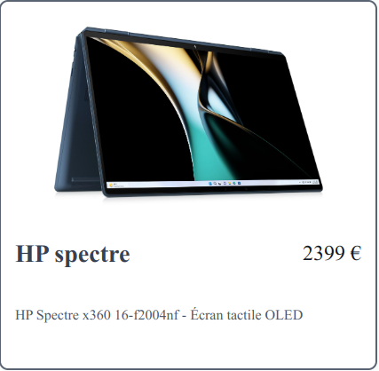
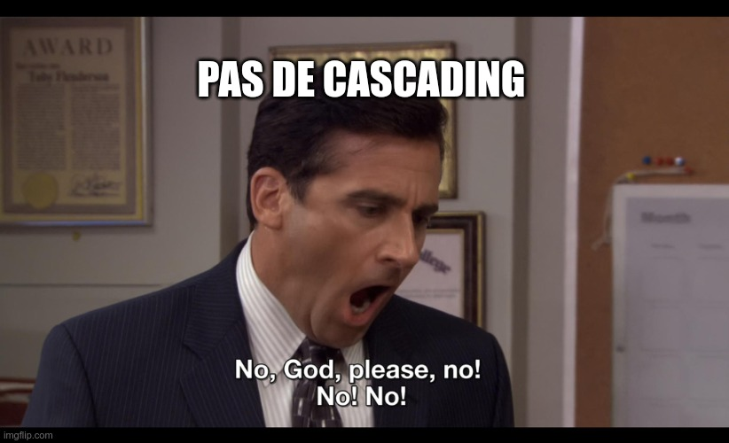

== Des exemples ?

[%step]

=== !

[NOTE.speaker]
--
* Exemple simple de mise en forme d'une fiche produit
--

[source,javascript,highlight="1-15|25-31|36-43|45-53|55-66"]
----
const styles = stylex.create({
  image: {
    height: 180,
    objectFit: 'contain'
  },
  titleRow: {
    alignItems: 'center',
    display: 'flex',
    justifyContent: 'space-between'
  },
  title: {
    color: 'rgb(55 65 81)',
    fontSize: '1.4rem'
  }
})

export const Product = ({ product }: ProductProps) => {
  return (
    

      
      

        <h3 {...stylex.props(styles.title)}>
          {product.title}
        </h3>
      

    

  );
}

export const styleBases = stylex.create({
  borderRadius: {
    borderColor: colors.borderMain,
    borderRadius: radius.medium,
    borderStyle: 'solid',
    borderWidth: 1
  }
});

const styles = stylex.create({
  body: {
    backgroundColor: 'white',
    borderWidth: 2,
    display: 'flex',
    flexDirection: 'column',
    padding: '0.8rem'
  }
})

export const Product = ({ product }: ProductProps) => {
  return (
    

      // ...
    

  );
}

----

[NOTE.speaker]
--
* Exemple simple de mise en forme d'une fiche produit
* L'idée est d'écrire un style par élément, le cascading n'est pas le principe de base
* Possibilité de définir des styles commum qu'on va pouvoir étendre dans les styles des composants
* La dernière règle gagne
--

=== Pseudo-classes

video::videos/demo-nav-hover.webm[opts="autoplay,loop"]

[NOTE.speaker]
--
* Comment faire des styles qui changent en fonction de l'état des éléments
--

=== !

[source,javascript,highlight="3-7|11-14|17-20|33-39"]
----
const styles = stylex.create({
  listItem: {
    backgroundColor: {
      default: 'rgb(17 24 39)',
      ':hover': 'rgb(55 65 81)',
      ':has([aria-current=page])': 'rgb(31 41 55)'
    },
    display: 'flex',
    flex: '1',
    borderRadius: '0.25rem',
    marginRight: {
      default: 0,
      ':not(:last-child)': '0.8rem'
    }
  },
  listItemLink: {
    color: {
      default: 'white',
      ':hover': 'rgb(229 231 235)'
    },
    fontSize: '1.4rem',
    flex: '1',
    paddingInline: '1.4rem',
    paddingVertical: '0.8rem'
  }
})

export const Link = (props: LinkProps) => {
  return (
    <li key={props.link.title}
            {...stylex.props(styles.listItem)}
    >
      <a {...stylex.props(
            styleBases.link,
            styles.listItemLink
         )}
         aria-current={
           props.ariaCurrent ? 'page' : undefined
         }
         href={link.href}
         onClick={() => {
           props.setActiveLink(props.link.href)
         }}
      >{props.link.title}</a>
    </li>
  )
}
----

[NOTE.speaker]
--
* Les pseudo-classes peuvent être utilisées comme clé pour définir les valeurs des propriétés en fonction de l'état
* Ça fonctionne également avec les pseudo éléments (`::before`, `::after`) même si il est conseillé de plutôt utiliser des balises
--

=== Responsive

video::videos/demo-responsive.webm[opts="autoplay,loop"]

=== !

[.large-code-exemple]
--

[source,javascript,highlight="6-13|21"]
----
const styles = stylex.create({
  productContainer: {
    backgroundColor: colors.backgroundSecondary,
    borderRadius: radius.soft,
    columnGap: spacing.sm,
    display: 'grid',
    gridTemplateColumns: {
      default: 'repeat(1, minmax(0, 1fr))',
      '@media (min-width: 640px)': 'repeat(1, minmax(0, 1fr))',
      '@media (min-width: 768px)': 'repeat(2, minmax(0, 1fr))',
      '@media (min-width: 1024px)': 'repeat(3, minmax(0, 1fr))',
      '@media (min-width: 1280px)': 'repeat(4, minmax(0, 1fr))'
    },
    padding: spacing.sm,
    rowGap: spacing.sm
  }
})

export const ProductList = () => {
  return (
    

      {products.map((product) =>
        <Product key={product.title} product={product}/>
      )}
    

  )
}
----

--

// TODO garder pour les formats plus long
// === !
//
// [source,javascript,highlight="3-7|10-14"]
// ----
// const styles = stylex.create({
//   menuDesktop: {
//     display: {
//       default: 'none',
//       '@media (min-width: 640px)': 'none',
//       '@media (min-width: 768px)': 'block'
//     }
//   },
//   menuMobile: {
//     display: {
//       default: 'block',
//       '@media (min-width: 640px)': 'block',
//       '@media (min-width: 768px)': 'none'
//     },
//     marginTop: spacing.sm
//   }
// });
// ----
//
// [NOTE.speaker]
// --
// * L'implémentation est équivalente mais avec des media query comme clé
// * Un probléme ici c'est qu'on répéte beaucoup de valeurs mais aussi de clé
// --

=== Variables

[.large-code-exemple]
--

[source,javascript,highlight="1-7|9-17|21"]
----
export const textSizes = stylex.defineVars({
  xs: '0.8rem',
  sm: '1.2rem',
  m: '1.4rem',
  l: '1.6rem',
  xl: '1.8rem'
});

export const gridTemplates = stylex.defineVars({
  listSm1Xl4: {
    default: 'repeat(1, minmax(0, 1fr))',
    '@media (min-width: 640px)': 'repeat(1, minmax(0, 1fr))',
    '@media (min-width: 768px)': 'repeat(2, minmax(0, 1fr))',
    '@media (min-width: 1024px)': 'repeat(3, minmax(0, 1fr))',
    '@media (min-width: 1280px)': 'repeat(4, minmax(0, 1fr))'
  }
});

const styles = stylex.create({
  productContainer: {
    gridTemplateColumns: gridTemplates.listSm1Xl4
  }
})
----

--

[NOTE.speaker]
--
* Les variables répondent à cette problématique
* Mais un peu permissif (string)
--

=== Et avec des types ?

[.large-code-exemple]
--

[source,javascript,highlight="1-14|16-27|29-35"]
----
type RGB_COLOR = `rgb(${number} ${number} ${number})`
type COLORS_VARIANT = 'GRAY_900' | 'GRAY_800' | 'GRAY_700' | 'GRAY_600' | 'GRAY_200' | 'GRAY_100' | 'WHITE'

const pallette: Record<COLORS_VARIANT, RGB_COLOR> = {
  GRAY_900: 'rgb(17 24 39)',
  GRAY_800: 'rgb(31 41 55)',
  GRAY_700: 'rgb(55 65 81)',
  GRAY_600: 'rgb(75 85 101)',
  GRAY_200: 'rgb(229 231 235)',
  GRAY_100: 'rgb(248 252 250)',
  WHITE: 'rgb(255 255 255)'
}

type PALLETTE_COLOR = typeof pallette[COLORS_VARIANT]

export const colors = stylex.defineVars<Record<
string, PALLETTE_COLOR>>({
  backgroundNavMain: pallette.GRAY_900,
  backgroundNavSecondary: pallette.GRAY_800,
  backgroundNavActive: pallette.GRAY_700,
  linkNavMain: pallette.WHITE,
  linkNavHover: pallette.GRAY_200,
  titleMain: pallette.GRAY_700,
  titleSecondary: pallette.GRAY_700,
  textMain: pallette.GRAY_900,
  textSecondary: pallette.GRAY_600
});

const styles: StyleXStyles<{
  color: PALLETTE_COLOR
}> = stylex.create({
  text: {
    color: colors.backgroundNavMain
  }
});

----
--

[NOTE.speaker]
--
* Un autre avantage de StyleX c'est qu'il permet de typer les styles pour en contraindre l'utilisation
* Cela demande un peu de configuration mais on peut arriver à définir
--

=== Thème

video::videos/stylex-dark-mode.webm[opts="autoplay,loop"]

[.theme-video-mask]
--
--

=== !

[source,javascript,highlight="1-11 |17-20|32-36"]
----
const DARK = '@media (prefers-color-scheme: dark)';
export const darkTheme = stylex.createTheme(colors, {
  titleMain: {
    default: pallette.GRAY_700,
    [DARK]: pallette.WHITE
  },
  titleSecondary: {
    default: pallette.GRAY_700,
    [DARK]: pallette.GRAY_100
  }
  /* ...*/
});

export const ProductList = () => {
  return (
    

      {
        products.map((product) =>
          <Product key={product.title} product={product}/>)
      }
    

  )
}

export const Product = ({ product }: ProductProps) => {
  return (
    

      {/* ... */}
    

  );
}

----

[NOTE.speaker]
--
* Possible de définir des surcharges des variables
* Permet d'appliquer des transformation globale comme par exemple un theme sombre
* Dans cet exemple on se base sur une media query pour permuter les valeurs des variables
* Attention il n'est pas possible de travailler avec une classes de contexte. Il faut trouver d'autres solutions pouvant être utilisées dans le contexte du composant
* L'application du theme se fait en fournissant le theme à la liste des styles qu'on souhaite surcharger
--

=== Démarrer avec StyleX

[.bundler.esbuild]

[.bundler.babel]
image::./images/babel.png[]
[.bundler.webpack]
image::./images/webpack.svg[]
[.bundler.rollup]
image::./images/rollup.svg[]
[.bundler.vitejs]
image::./images/vitejs.svg[]

[NOTE.speaker]
--
* Comment démarrer un projet ? Est-il possible de l'intégrer dans mon contexte ?
* Réponse courte oui. Réponse longue : StyleX propose des plugins pour s'intégrer dans les builder les plus commun (Rollup, Webpack, Next.js, esbuild).
* Vite plugin communautaire
* Babel permet de s'intégrer avec à peu près n'importe quoi
--

// // TODO garder pour les formats plus long
// === Un exemple ?
//
// [.demo-time]
// image::images/demo-time-js.jpeg[]
//
// [NOTE.speaker]
// --
// * Esbuild et Typescript
// ** Montrer la configuration mais ne pas rentrer trop dans détail
// ** Parler d'ESLint
// *  `npm start`
// * Montrer la page
// * Ouvrir la console et inspecter un élément pour montrer les classes associées
// ** Intéressant de montrer par exemple le $ pour le pseudo élément
// * Démonstration erreurs ?
// * Démonstration de modification
// ** Une autre chose qu'on a rapidement envie de faire c'est de partager des définition de styles. Exemple radius. Faire une démo de modification
// * Démonstration `npm run build` puis montrer le résultat dans le navigateur
// --

////
=== Projet existant Angular

[NOTE.speaker]
--
* Demonstration config ?
* Demonstration start + build ?
--

=== Organiser ses styles

[NOTE.speaker]
--
* StyleX nous pousse à adopter le de co-localisation des styles avec les composant rattachés, la construction assurant la déduplication des styles dans le livrable final (https://stylexjs.com/docs/learn/thinking-in-stylex/).
* Pas mal de contraintes (déclaration statiques etc.) qui oblige à suivre une certaine logique
--

////

=== L'expérience développeur

[%step]
--
**The good**

* Rapide à apprendre
* Aucun problème de collision
* Prédictible
* DRY
--

=== !

**The bad**

[source,html]
----

    <!-- ... -->

----

=== !

**The ugly**

